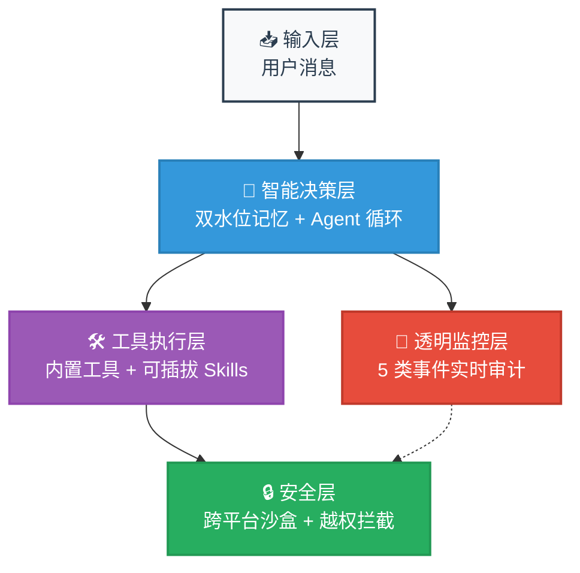
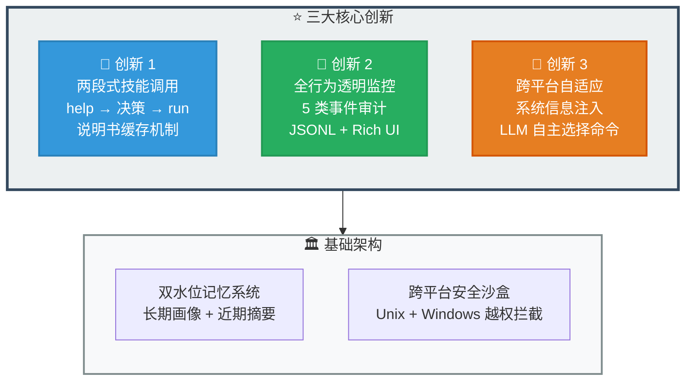
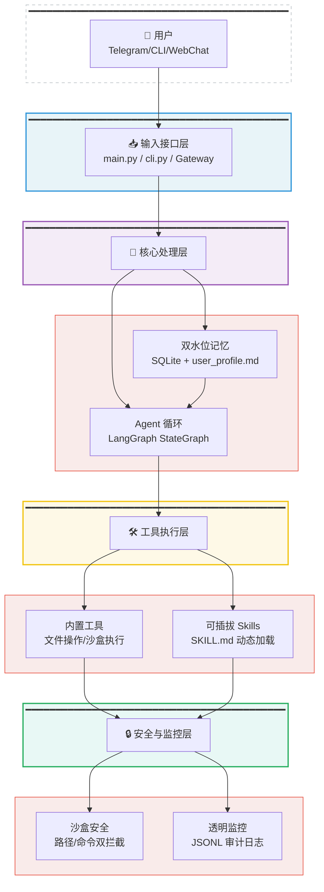
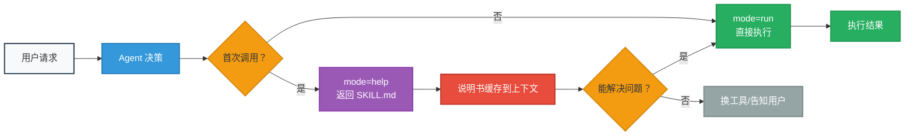
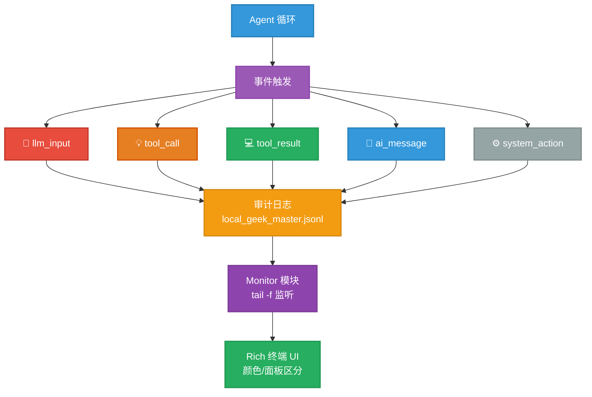
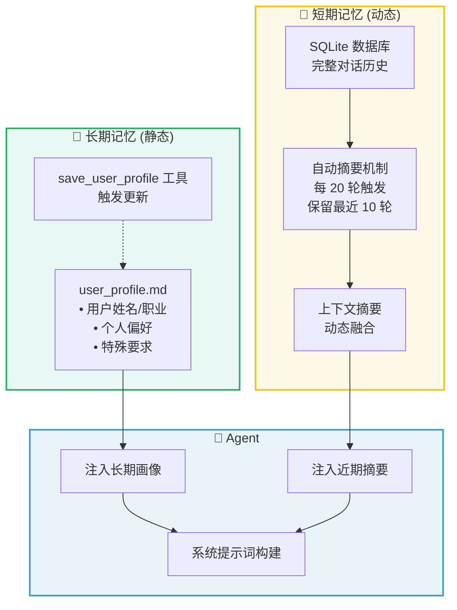
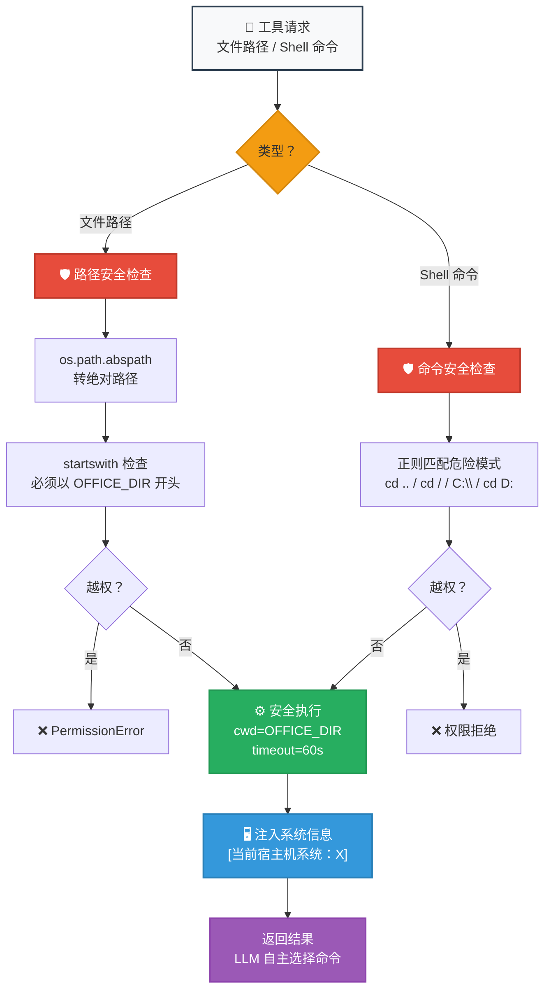

# CyberClaw 架构图

> 透明可控的 AI 工作台 · Transparent & Controllable AI Workspace

---

## 🎯 速览图



---

## 🔥 核心创新模块图



---

## 🏗️ 系统架构总览（学术风格）



---

## 📐 核心模块详解

### 1️⃣ 两段式技能调用（预防式安全）



### 2️⃣ 透明监控系统（信任建立机制）



### 3️⃣ 双水位记忆系统（个性化 + 连续性）



### 4️⃣ 跨平台安全沙盒（自适应策略）



---

## 📊 核心设计优势对比

| 设计特性 | 传统 Agent | CyberClaw | 优势 |
|---------|-----------|-----------|------|
| **工具调用** | 决定 → 立即执行 | help → 决策 → run | 预防错误，非事后补救 |
| **技能学习** | 每次从零开始 | 说明书缓存到上下文 | Token 节省 66%+ |
| **行为透明** | 黑盒 | Monitor 实时显示所有事件 | 建立信任，调试友好 |
| **记忆系统** | 单一上下文 | 长期画像 + 近期摘要 | 个性化 + 任务连续性 |
| **跨平台** | 硬编码适配 | 系统信息注入 + LLM 自适应 | 代码简洁，扩展性强 |
| **安全沙盒** | 单平台拦截 | Unix + Windows 双平台 | 全平台安全一致 |

---

## 🚀 技术栈

```
┌─────────────────────────────────────────────────────┐
│                   应用层                             │
│  main.py (CLI 入口)  │  monitor.py (监控)           │
├─────────────────────────────────────────────────────┤
│                   核心层                             │
│  agent.py (Agent 循环)  │  skill_loader.py (技能)   │
├─────────────────────────────────────────────────────┤
│                   工具层                             │
│  builtins.py (内置)  │  sandbox_tools.py (沙盒)    │
├─────────────────────────────────────────────────────┤
│                   框架层                             │
│  LangChain  │  LangGraph  │  SQLite                │
├─────────────────────────────────────────────────────┤
│                   运行时                             │
│  Python 3.10+  │  Node.js (技能脚本)                │
└─────────────────────────────────────────────────────┘
```

---

## 📁 项目结构

```
CyberClaw/
├── CyberClaw/                    # 核心包
│   ├── core/
│   │   ├── agent.py              # Agent 循环
│   │   ├── config.py             # 配置管理
│   │   ├── context.py            # 上下文修剪
│   │   ├── provider.py           # LLM 提供商
│   │   ├── skill_loader.py       # 动态技能加载
│   │   ├── logger.py             # 审计日志
│   │   └── tools/
│   │       ├── base.py           # 工具装饰器
│   │       ├── builtins.py       # 内置工具
│   │       └── sandbox_tools.py  # 沙盒工具
│   └── __init__.py
├── workspace/
│   ├── office/                   # 沙盒工位
│   │   ├── skills/               # 可插拔技能
│   │   │   ├── weather/
│   │   │   └── tavily-search/
│   │   └── .env                  # 环境变量
│   ├── memory/
│   │   └── user_profile.md       # 用户长期画像
│   └── state.sqlite3             # 对话历史
├── logs/
│   └── local_geek_master.jsonl   # 审计日志
├── main.py                       # CLI 入口
├── monitor.py                    # 监控终端
├── cli.py                        # 命令行工具
└── setup.py                      # 包配置
```

---

## 🎤 使用指南

### 30 秒快速介绍
> "CyberClaw 是一个透明可控的 AI 工作台，核心解决两个问题：**黑盒问题**（用透明监控层实时显示所有行为）和**不可控问题**（用两段式技能调用预防错误）。底层有双水位记忆系统和跨平台安全沙盒。"

### 3-5 分钟深入讲解
> "三大核心创新：
> 1. **两段式技能调用**：help → 决策 → run，说明书缓存到上下文，Token 节省 66%
> 2. **全行为透明监控**：5 类事件实时审计，JSONL 日志 + Rich 终端 UI
> 3. **跨平台自适应**：系统信息注入，LLM 自主选择命令，无需硬编码适配"

### 技术细节 Q&A
> 滚动到对应模块详解图，展开讨论具体实现。

---

> **设计哲学**: 透明 > 自动，可控 > 智能
> 
> CyberClaw 不是追求"全自动"的黑盒，而是让用户和 AI 都能清楚知道**正在发生什么**、**为什么这么做**、**接下来会怎样**。
