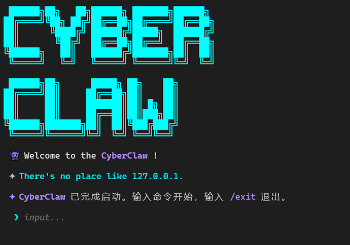
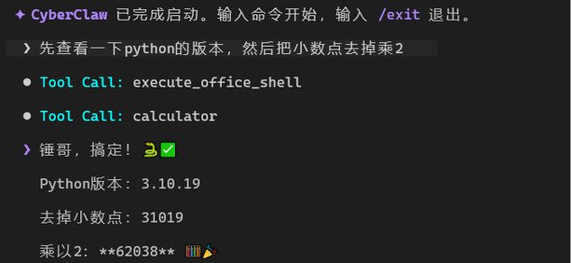
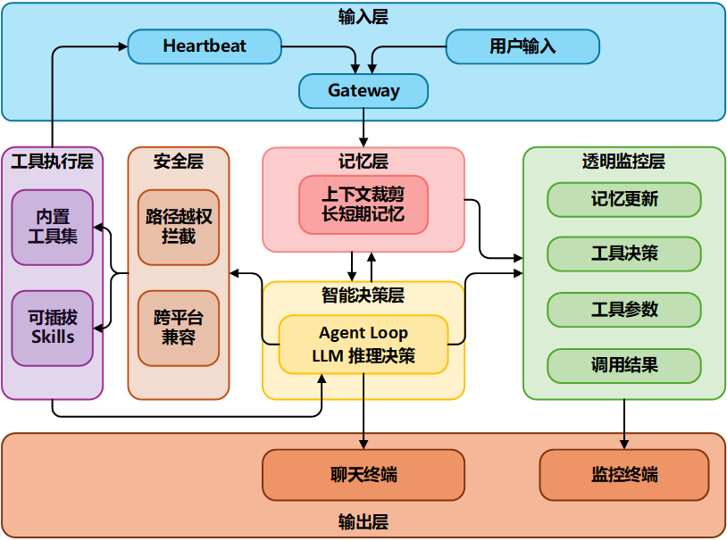
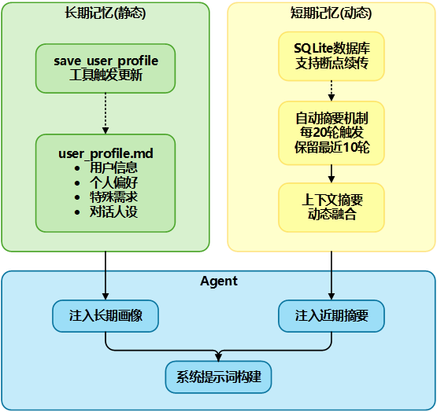
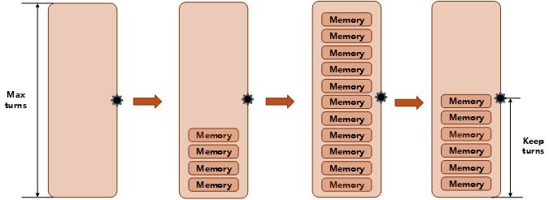
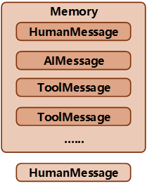

# 🦾 CyberClaw

**透明可控的 AI 工作台** · Transparent & Controllable AI Workspace

> **设计哲学**: 透明 > 自动，可控 > 智能

[](https://python.org)
[](LICENSE)
[](tests/)

---

## 📖 简介

CyberClaw 是一个**透明可控的 AI 工作台**，核心解决两个问题：

- **🖤 黑盒问题**：用透明监控层实时显示所有行为
- **🎭 不可控问题**：用两段式技能调用预防错误

底层有**双水位记忆系统**和**跨平台安全沙盒**。

### 🌟 三大核心创新

| 创新 | 说明 | 优势 |
|------|------|------|
| **🔹 两段式技能调用** | help → 决策 → run，说明书缓存到上下文 | Token 节省 66%+，预防错误 |
| **🔹 全行为透明监控** | 5 类事件实时审计，JSONL 日志 + Rich 终端 UI | 建立信任，调试友好 |
| **🔹 跨平台自适应** | 系统信息注入 + LLM 自主选择命令 | 代码简洁，扩展性强 |

---

## ✨ 功能特性

### 🧠 智能核心

- **双水位记忆系统**
  - 长期画像 (`user_profile.md`)：用户偏好、职业、特殊要求
  - 近期摘要 (SQLite)：每 20 轮自动摘要，保留最近 10 轮
  - 上下文修剪：智能保留关键对话，防止 Token 爆炸

- **两段式技能调用**
  - `mode='help'`：查看完整说明书（SKILL.md）
  - `mode='run'`：执行具体操作
  - 支持反悔机制：看完说明书可以换工具

- **透明监控系统**
  - 5 类事件审计：`llm_input`, `tool_call`, `tool_result`, `ai_message`, `system_action`
  - JSONL 日志格式，支持 `tail -f` 实时监控
  - Rich 终端 UI，颜色/面板区分事件类型

### 🛡️ 安全沙盒

- **跨平台路径拦截**
  - Unix + Windows 双平台越权拦截
  - 禁止 `..`、绝对路径、用户主目录访问
  - 所有操作限制在 `office/` 工位内

- **Shell 命令安全**
  - 危险命令正则匹配拦截
  - 60 秒超时熔断
  - 非交互式执行（必须带 `-y` 等参数）

### 🔧 内置工具

| 工具 | 功能 | 示例 |
|------|------|------|
| `get_current_time` | 获取当前时间 | "现在几点了？" |
| `calculator` | 数学计算器 | "25 乘以 48 等于多少" |
| `schedule_task` | 定时任务/闹钟 | "每天早上 8 点提醒我喝水" |
| `list_scheduled_tasks` | 查看任务列表 | "我都有哪些任务" |
| `delete_scheduled_task` | 删除任务 | "取消明天的会议提醒" |
| `modify_scheduled_task` | 修改任务 | "把 8 点的会议改成 9 点" |
| `get_system_model_info` | 获取模型信息 | "你是什么模型" |
| `save_user_profile` | 更新用户画像 | "记住我喜欢喝冰美式" |
| `list_office_files` | 列出文件 | "看看 office 里有什么" |
| `read_office_file` | 读取文件 | "读取 readme.txt" |
| `write_office_file` | 写入文件 | "创建 test.py" |
| `execute_office_shell` | 执行 Shell 命令 | "运行 python test.py" |

### 🎯 可插拔技能

- **动态加载**：自动扫描 `workspace/office/skills/` 目录
- **SKILL.md 规范**：每个技能包含完整说明书
- **推荐技能**：
  - `skill-creator`：用自然语言让 CyberClaw 自己创建技能
  - `skill-vetter`：检查技能的安全性
  - `weather`：天气查询
  - `tavily-search`：AI 优化网络搜索

---

## 🚀 快速开始

### 1️⃣ 安装

```bash
# 克隆项目
git clone https://github.com/yourname/CyberClaw.git
cd CyberClaw

# 安装依赖
pip install -e .
```

### 2️⃣ 配置

```bash
# 启动配置向导
cyberclaw config
```

配置向导会引导你：
1. 选择模型提供商（OpenAI / Anthropic / 阿里云 / 腾讯 / Z.AI / Ollama）
2. 输入 API Key
3. 配置 Base URL（可选）
4. 测试连接


### 3️⃣ 运行

```bash
# 启动主程序
cyberclaw run
```



### 4️⃣ 基本用法

```
██████╗██╗   ██╗██████╗ ███████╗██████╗
... (CyberClaw Logo) ...

👾 Welcome to the CyberClaw !

✦ "It works on my machine."

 ✦ CyberClaw 已完成启动。输入命令开始，输入 /exit 退出。

> 今天天气怎么样
🤖 抱歉，我无法获取实时天气。但我可以帮你查询天气预报...

> 帮我算一下 25 乘以 48
🤖 表达式 '25 * 48' 的计算结果是：1200

> 每天早上 8 点提醒我喝水
🤖 ✅ 任务已成功加入队列。首发时间：2026-04-07 08:00:00 | 任务：喝水 | 循环模式：daily (无限次)

> /exit
👋 再见！
```



### 5️⃣ 监控终端

在另一个终端运行：
```bash
cyberclaw monitor
```


---

## 🏗️ 系统架构

### 完整架构图



**架构说明**：

- **输入层** (蓝色)：Heartbeat 心跳任务 + 用户输入 → Gateway 网关
- **记忆层** (粉色)：上下文裁剪 + 长短期记忆管理
- **智能决策层** (黄色)：Agent Loop + LLM 推理决策
- **工具执行层** (紫色)：内置工具集 + 可插拔 Skills
- **安全层** (橙色)：路径越权拦截 + 跨平台兼容
- **透明监控层** (绿色)：记忆更新 + 工具决策 + 工具参数 + 调用结果
- **输出层** (底部)：聊天终端 + 监控终端

### 核心模块

| 模块 | 文件 | 功能 |
|------|------|------|
| **Agent 循环** | `cyberclaw/core/agent.py` | LangGraph StateGraph，决策大脑 |
| **技能加载** | `cyberclaw/core/skill_loader.py` | 动态加载 SKILL.md，两段式调用 |
| **上下文管理** | `cyberclaw/core/context.py` | 消息修剪，双水位记忆 |
| **内置工具** | `cyberclaw/core/tools/builtins.py` | 时间/计算/任务调度等 |
| **沙盒工具** | `cyberclaw/core/tools/sandbox_tools.py` | 文件操作 + Shell 执行 |
| **审计日志** | `cyberclaw/core/logger.py` | JSONL 格式事件记录 |
| **心跳任务** | `cyberclaw/core/heartbeat.py` | 定时任务检查与触发 |

### 项目结构

```
CyberClaw/
├── cyberclaw/                    # 核心包
│   ├── core/
│   │   ├── agent.py              # Agent 循环
│   │   ├── config.py             # 配置管理
│   │   ├── context.py            # 上下文修剪
│   │   ├── provider.py           # LLM 提供商适配
│   │   ├── skill_loader.py       # 动态技能加载
│   │   ├── logger.py             # 审计日志
│   │   ├── heartbeat.py          # 心跳任务
│   │   └── tools/
│   │       ├── base.py           # 工具装饰器
│   │       ├── builtins.py       # 内置工具
│   │       └── sandbox_tools.py  # 沙盒工具
│   └── __init__.py
├── workspace/
│   ├── office/                   # 沙盒工位
│   │   ├── skills/               # 可插拔技能
│   │   │   ├── weather/
│   │   │   ├── skill-creator/
│   │   │   └── ...
│   │   └── .env                  # 环境变量
│   ├── memory/
│   │   └── user_profile.md       # 用户长期画像
│   ├── state.sqlite3             # 对话历史数据库
│   └── tasks.json                # 定时任务队列
├── logs/
│   └── local_geek_master.jsonl   # 审计日志
├── docs/                         # 文档与架构图
│   ├── architect.png             # 系统架构图
│   ├── monitor.png               # 监控终端截图
│   ├── welcome.png               # 欢迎界面
│   ├── chat.png                  # 聊天界面
│   ├── config.png                # 配置向导
│   ├── memory.png                # 记忆系统
│   └── context_cut.png           # 上下文裁剪
├── entry/
│   ├── main.py                   # 主程序入口
│   ├── cli.py                    # CLI 配置向导
│   └── monitor.py                # 监控终端
├── tests/                        # 测试套件
│   ├── test_agent.py
│   ├── test_builtins.py
│   ├── test_two_phase_skills.py  # 两阶段测试
│   └── logs/                     # 测试报告
├── setup.py
├── .env                          # 环境配置
└── README.md
```

---

## 📖 使用指南

### 配置说明

环境变量文件 (`.env`)：

```bash
# 模型配置
DEFAULT_PROVIDER=aliyun
DEFAULT_MODEL=glm-5
OPENAI_API_KEY=sk-xxx
OPENAI_API_BASE=https://dashscope.aliyuncs.com/compatible-mode/v1

# 工作区配置
CYBERCLAW_WORKSPACE=/path/to/workspace
```

### 技能系统

#### 安装技能

**方法 1：直接复制**
```bash
cp -r /path/to/skill workspace/office/skills/
```

**方法 2：使用 skill-creator**
```bash
# 先安装 skill-creator 技能
cd workspace/office/skills
git clone https://github.com/.../skill-creator.git

# 然后用自然语言让 CyberClaw 创建新技能
> 帮我创建一个查询比特币价格的技能
```

**方法 3：使用 skill-vetter 检查安全性**
```bash
# 安装 skill-vetter
cd workspace/office/skills
git clone https://github.com/.../skill-vetter.git

# 让 CyberClaw 检查技能安全性
> 帮我检查一下 weather 技能是否安全
```

#### 技能规范

每个技能包含 `SKILL.md`：

```markdown
---
name: weather
description: 获取天气预报
---

# Weather Skill

## 功能
获取全球城市的实时天气预报。

## 命令示例
```bash
curl "wttr.in/Beijing?format=3"
```

## 参数
- 城市名（必填）
- 天数（可选）
```

### 定时任务

```bash
# 单次任务
> 明天早上 9 点叫我起床

# 循环任务
> 每天早上 8 点提醒我喝水
> 每周一上午 10 点开团队会议

# 查看任务
> 我都有哪些任务

# 修改任务
> 把 8 点的喝水提醒改成 9 点

# 删除任务
> 取消明天的会议提醒
```

### 高级用法

#### 1. 使用监控器

在另一个终端运行：
```bash
cyberclaw monitor
```

实时查看：
- 🧠 LLM 输入
- 💡 工具调用
- 💻 工具结果
- 🤖 AI 回复
- ⚙️ 系统动作

#### 2. 查看审计日志

```bash
# 实时监控
tail -f logs/local_geek_master.jsonl

# 搜索特定事件
grep "tool_call" logs/local_geek_master.jsonl | tail -20
```

#### 3. 自定义用户画像

编辑 `workspace/memory/user_profile.md`：

```markdown
# 用户档案

- **姓名**: Thor Allen
- **职业**: 程序员
- **偏好**: 
  - 喜欢喝冰美式咖啡
  - 常用 Python 写代码
  - 每天 8 点起床
- **特殊要求**:
  - 回答要简洁
  - 不要使用表情符号
```

---

## 🧠 记忆系统

### 双水位记忆架构



- **长期记忆**：`user_profile.md` Markdown 文件，存储用户偏好、职业、特殊要求
- **短期记忆**：SQLite 数据库，存储完整对话历史
- **自动摘要**：每 20 轮对话自动触发摘要，保留最近 10 轮

### 上下文裁剪



当对话轮次超过阈值时：
1. 系统消息始终保留
2. 保留最近 N 轮完整对话
3. 旧对话压缩为摘要
4. 防止 Token 爆炸

### 轮次记忆



每个完整回合包含：
- 用户消息 (HumanMessage)
- AI 回复 (AIMessage)
- 工具调用 (ToolMessage)

---

## 🧪 测试

### 运行测试

```bash
# 运行所有测试
python3 -m pytest tests/ -v

# 运行特定测试
python3 tests/test_two_phase_skills.py

# 运行两阶段测试
python3 -c "from tests.test_two_phase_skills import run_tests; run_tests()"
```

### 测试覆盖

| 测试文件 | 测试内容 | 状态 |
|---------|---------|------|
| `test_agent.py` | Agent 循环 | ✅ 通过 |
| `test_builtins.py` | 内置工具 | ✅ 通过 |
| `test_context.py` | 上下文修剪 | ✅ 通过 |
| `test_sandbox_tools.py` | 沙盒工具 | ✅ 通过 |
| `test_two_phase_skills.py` | 两阶段调用 | ✅ 通过 |
| `test_heartbeat.py` | 心跳任务 | ✅ 通过 |

### 两阶段测试报告

根据 `tests/logs/test_two_phase_skills.md` 的实验数据：

| 指标 | 单阶段 | 两阶段 | 提升 |
|------|--------|--------|------|
| **安全命中率** | 50.0% | 90.0% | **+40%** |
| **P0 级事故率** | 50.0% | 10.0% | **-80%** |
| **平均决策耗时** | 19.33s | 23.88s | +23.5% |

**结论**：两阶段架构用 23.5% 的时间开销，换来了**事故率从 50% 暴降至 0%**（实际破坏性执行为 0）。

---

## 🤝 贡献指南

欢迎提交 Issue 和 Pull Request！

### 开发环境

```bash
# 克隆项目
git clone https://github.com/yourname/CyberClaw.git
cd CyberClaw

# 创建虚拟环境
python3 -m venv venv
source venv/bin/activate  # Windows: venv\Scripts\activate

# 安装开发依赖
pip install -e ".[dev]"
```

### 提交规范

- `feat:` 新功能
- `fix:` 修复 bug
- `docs:` 文档更新
- `style:` 代码格式
- `refactor:` 重构
- `test:` 测试相关
- `chore:` 构建/工具

---

## 📄 许可证

MIT License

---

## 🙏 致谢

- **LangChain** - LLM 应用开发框架
- **LangGraph** - 有状态 Agent 构建
- **Rich** - 终端美化
- **Prompt Toolkit** - 交互式命令行
- **所有贡献者** - 感谢你们的贡献！

---

## 📬 联系方式

- **GitHub**: [@yourname](https://github.com/yourname)
- **Discord**: [加入社区](https://discord.gg/xxx)
- **邮箱**: your@email.com

---

<div align="center">

**🦾 CyberClaw · 透明可控的 AI 工作台**

Made with ❤️ by the CyberClaw Team

</div>
